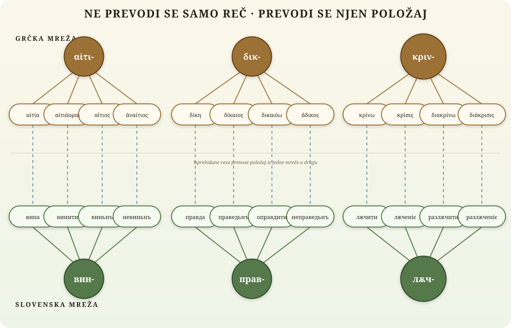

# Mreža prevoda

Reč ne nosi značenje sama. Njeno značenje određuju mesto u porodici i veze sa
drugim rečima: zajednički koren, prefiks, negacija, vrsta izvedenice i odnos
prema susednim pojmovima.

Zato prevod ne spaja samo dve reči, nego dve mreže:

```text
                    grčka mreža značenja
                            ⇣ ⇣ ⇣
                  slovenska mreža značenja
```

## Mreža



Svaka puna veza pripada unutrašnjoj građi jednog jezika. Isprekidana veza je
prevod. Dobar prevod čuva ne samo svaki pojedinačni čvor nego, koliko god je
moguće, i isti raspored veza oko njega.

```text
 αἴτιος nije samo „виньнъ“

 αἴτιος svoje značenje dobija iz odnosa prema αἰτία, αἰτιάομαι i ἀναίτιος
    │
    └─ zato виньнъ mora ostati u odnosu prema вина, винити i невиньнъ
```

To je ideal mreže prevoda:

> Ne prevoditi samo reč. Prevesti njen položaj u jeziku.

[`RECNIK.md`](RECNIK.md) ostaje autoritet za pojedinačne termine.
